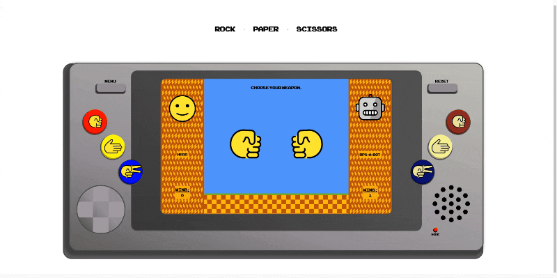
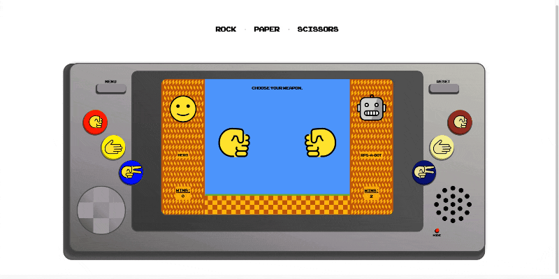
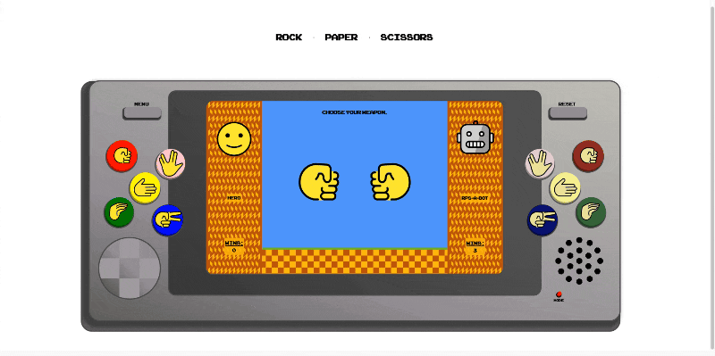

# 🪨 📰 ✂️ [ROCK · PAPER · SCISSORS](https://seth-way.github.io/rock-paper-scissors/) 🪨 📰 ✂️

☝️ Click the link for a working deployment of this repo.

### Abstract:

[//]: <> (Briefly describe what you built and its features. What problem is the app solving? How does this application solve that problem?)

- This project will be a learning tool to demonstrate my understanding of writing DRY JavaScript, properly utilizing event delegation, and utilizing CSS to create a clean and intuitive user experience.

- This app will allow a user to play a fun & interactive game of Rock, Paper, Scissors.

### Installation Instructions:

[//]: <> (What steps does a person have to take to get your app cloned down and running?)

- Fork this project to your own Github account.
- Clone the repository to your local machine.
- `cd` into the project directory.
- Use the `open index.html` command to view the webpage.

### Preview of App:

[//]: <> (Provide ONE gif or screenshot of your application - choose the "coolest" piece of functionality to show off.)
##### This app features an intuitive and sleek UI for fun & engaging gameplay.

##### Play Classic Rock, Paper, or Scissors - OR - Switch to 'Advanced Mode' for more choices & outcomes.

##### Make changes in the 'User Menu' for custom player names, avatars, and even switch to 2 Player Mode.

### Context:

[//]: <> (Give some context for the project here. How long did you have to work on it? How far into the Turing program are you?)

- This app was built as the final Mod 1 solo project in Week 5/6 of Turing's FE Software Development Bootcamp.
- It is meant to demonstrate web-dev skills in JS, HTML, CSS & DOM manipulation.
- It took roughly 6 days or 20+ hours to complete.

### Contributors:

[//]: <> (Who worked on this application? Link to their GitHubs.)

This app was built by [Seth Way](https://github.com/seth-way).

### Learning Goals:

[//]: <> (What were the learning goals of this project? What tech did you work with?)

- This project will reinforce my learning of Javascript, HTML, & CSS.

### Wins + Challenges:

[//]: <> (What are 2-3 wins you have from this project? What were some challenges you faced - and how did you get over them?)
- This project challenged my understanding of CSS animations & async delays. It was difficult, but rewarding to create a seamless UX, while keeping possible bugs out of the DOM during delays.
- The 'console' was a complicated & layered element that required carefull planning and manipulation to create. Parts needed to be hidden and cursor events disabled as necessary to elimate unwanted DOM activities.
- This is the most complex CSS I have built to date & required research in CSS variables, color blending, @keyframe animations, transitions, and layering through absolute-positioning. I'm very pleased with the final product.
